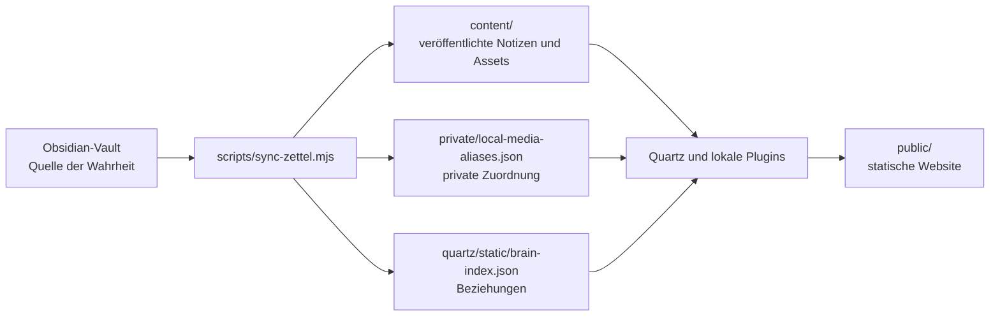

# Architektur und Synchronisierung

## Datenfluss



`npm run dev` und `npm run build` stoßen diesen Ablauf an. `content/` wird bei der Synchronisierung neu erzeugt. Deshalb dürfen Korrekturen an Notizen oder Metadaten nicht nur dort vorgenommen werden.

## Quelle und Veröffentlichungsgrenze

Standardquelle ist der gesamte Vault:

```txt
/Users/moritzvitt/Library/Mobile Documents/iCloud~md~obsidian/Documents/Obsidian Notes
```

Eine Markdown-Notiz wird nur veröffentlicht, wenn ihr Frontmatter ausdrücklich `publish: true` oder `dg-publish: true` enthält. `draft: true`, `publish: false` und `dg-publish: false` schließen sie aus. Die Ordner `.git`, `.obsidian`, `.trash` und `node_modules` werden nicht durchsucht.

Die Quelle kann für Builds und Tests überschrieben werden:

```sh
ZETTEL_SOURCE_ROOT="/anderer/vault" npm run build
```

`DIGITAL_GARDEN_ROOT` wird aus Kompatibilitätsgründen ebenfalls akzeptiert. Für Bilder, Filme und Transkripte existieren zusätzlich `ZETTEL_PICTURES_ROOT`, `ZETTEL_MOVIES_ROOT` und `ZETTEL_TRANSCRIPTS_ROOT`.

## Öffentliche Pfade

Die veröffentlichte Notiz `Digital Garden/Digital Garden.md` wird zu `content/index.md`. Die älteren Dateien mit dem Namen `Welcome in my Digital Garden!.md` bleiben als Startseitenquellen kompatibel.

Bei Dateien unter `Digital Garden/` wird dieses Präfix aus dem öffentlichen Pfad entfernt. Dadurch bleiben historische URLs stabil. Veröffentlichte Notizen aus anderen Vault-Ordnern behalten dagegen ihren Vault-relativen Ordnerpfad.

## Frontmatter und Base-Properties

Der Sync erzeugt öffentliches Frontmatter mit Titel, Quelle, Veröffentlichungsstatus, Tags, Aliasen und Graph-Beziehungen. Eine definierte Menge zusätzlicher Felder wird übernommen, darunter Beziehungen, `media`, `language`, `cover`, `vocab-trainer`, Verschlüsselungs- und Sichtbarkeitsfelder.

Zusätzlich werden alle direkten Notiz-Properties übernommen, auf die eine `.base`-Datei verweist. Ausgewertet werden insbesondere:

- `order`
- `sort`
- `groupBy.property`
- `image`
- Datums- und Board-Felder
- `columnSize`
- `summaries`

Bei `note.creator` wird beispielsweise `creator` veröffentlicht. Virtuelle Felder unter `file.*`, `formula.*` und `this.*` werden nicht als Frontmatter kopiert. So erhält die Website die für Bases benötigten Daten, ohne pauschal jedes private Property zu veröffentlichen.

Hierarchische Tags werden erweitert: Aus `japanese/relationships` entstehen sowohl `japanese` als auch `japanese/relationships`. Jede veröffentlichte Notiz erhält außerdem den Tag `zettel`.

## Links, Assets und Beziehungen

Wikilinks werden gegen die veröffentlichten Notizen aufgelöst. Eingebettete Bilder und PDFs aus dem Vault werden in den passenden `content/`-Ordner kopiert beziehungsweise als Web-Embed ausgegeben. Lokale Dateien außerhalb des Vaults folgen den Regeln unter [Lokale Medien](local-media.md).

Ein Abschnitt `## Links` kann strukturierte Beziehungen enthalten:

```md
Parent:: [[Übergeordnete Notiz]]
Child:: [[Untergeordnete Notiz]]
Prev:: [[Vorherige Notiz]]
Next:: [[Nächste Notiz]]
Friend:: [[Verwandte Notiz]]
```

`scripts/relationship-parser.mjs` normalisiert diese Beziehungen. Der Sync erzeugt daraus `quartz/static/brain-index.json`, einschließlich inverser Beziehungen. Ordner ohne eigene Indexnotiz erhalten eine generierte `index.md`.

## Relevante Ausgaben

- `content/**/*.md`: veröffentlichte und transformierte Notizen
- `content/**`: benötigte veröffentlichbare Assets
- `content/**/index.md`: automatisch erzeugte Ordnerseiten
- `quartz/static/brain-index.json`: Struktur- und Linkindex
- `private/local-media-aliases.json`: lokale, von Git ausgeschlossene Alias-Zuordnung
- `public/`: fertige Website; wird nicht committed
